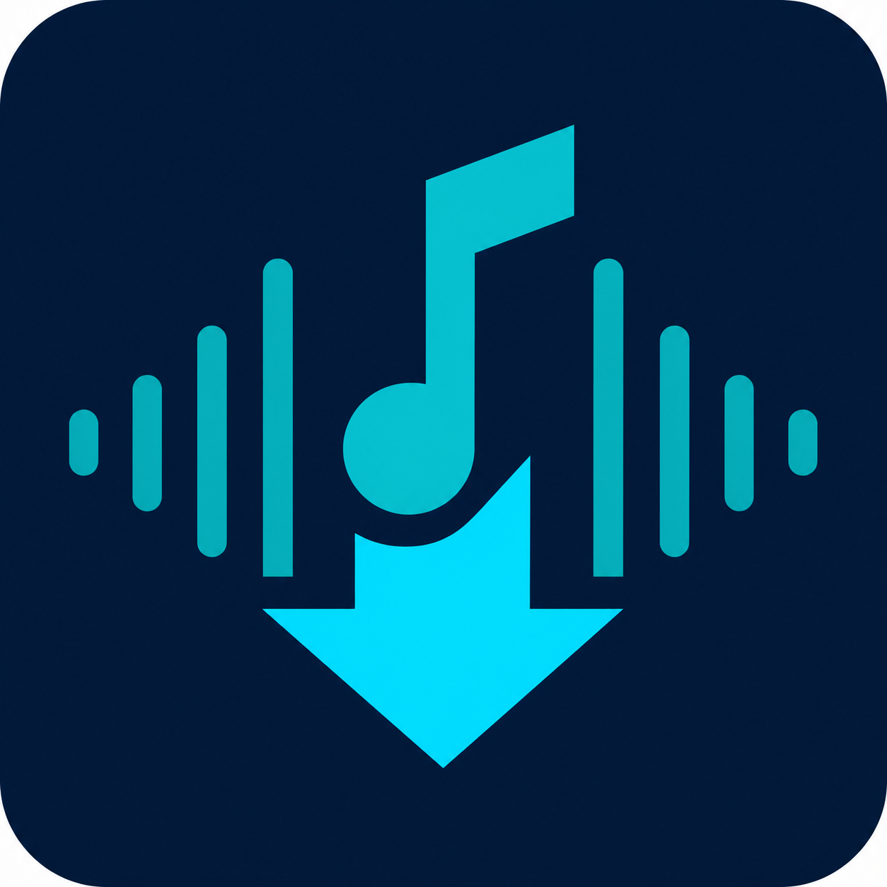

<div align="center">
  <a href="https://github.com/Misiu/yt_dlp-app">
    
  </a>

  <h1>YouTube Audio Downloader for Home Assistant</h1>

  <p>
    Download authorized YouTube audio as tagged MP3 files directly into Home Assistant media storage.
  </p>
</div>

<div align="center">

[](https://github.com/Misiu/yt_dlp-app/actions/workflows/ci.yaml)
[](https://github.com/Misiu/yt_dlp-app/actions/workflows/release.yaml)
[](LICENSE)
[](https://github.com/Misiu/yt_dlp-app/stargazers)
[](https://github.com/Misiu/yt_dlp-app/actions/workflows/release.yaml)


</div>

## Overview

YouTube Audio Downloader is a Home Assistant App (the feature was formerly called an add-on). It provides an Ingress Web UI and stable REST API, keeps a durable one-at-a-time queue in SQLite, downloads the best available audio stream with `yt-dlp`, converts it with `ffmpeg`, and writes a safely named MP3 with ID3 tags and cover art below `/media`.

## Features

- Ready-to-run `amd64` and `aarch64` images with ffmpeg, Node/EJS challenge support, and all runtime dependencies, published as one GHCR multi-architecture manifest.
- Strict HTTPS YouTube URL allowlist, playlist prevention, path containment, bounded metadata/cover handling, and no user-supplied downloader arguments.
- Durable FIFO queue and history with restart recovery, cancellation, pagination, filtering, and stable error codes.
- Responsive English/Polish Lit interface with Web Awesome, SSE updates, dark mode, keyboard support, and Ingress-safe relative URLs.
- Atomic MP3 publication, filename collision handling, ID3v2.3 tags, optional JPEG cover, disk-space check, timeouts, and stale-temp cleanup.
- Least-privilege Home Assistant configuration: no Supervisor/Core API, host network, devices, or privileged capabilities.

## Installation

[](https://my.home-assistant.io/redirect/supervisor_add_addon_repository/?repository_url=https%3A%2F%2Fgithub.com%2FMisiu%2Fyt_dlp-app)

1. Click the button above to add this repository to Home Assistant.
2. Open **Settings → Apps → App store**.
3. Search for **YouTube Audio Downloader**.
4. Select the app and click **Install**.
5. Open the **Configuration** tab and choose the destination folder.
6. Start the app.
7. Enable **Show in sidebar** on the app Info page if you want a permanent **YouTube Audio** sidebar entry.
8. Click **Open Web UI** or use that sidebar entry.

Version 0.1.5 is marked **experimental** until its Ingress, AppArmor, backup, download, integration discovery, and update paths have been verified on a real Home Assistant OS test instance.

To add it manually, open the App store repository dialog and enter:

```text
https://github.com/Misiu/yt_dlp-app
```

No cloning, local image build, Python, Node, `yt-dlp`, or `ffmpeg` installation is required.

## Screenshots

The Web UI follows Home Assistant settings-page patterns: URL form, current download, queue, responsive history, and diagnostics. It is compiled and tested in CI before each image is published. Release screenshots can be added after visual verification inside a real Home Assistant Ingress frame; this README intentionally does not link to an unverified mockup.

## Configuration

| Option | Default | Description |
|---|---:|---|
| `output_directory` | `youtube_audio` | Folder below `/media`; an absolute contained `/media/...` path is also accepted. |
| `mp3_quality` | `320` | Output bitrate: 128, 192, 256, or 320 kbit/s. |
| `history_limit` | `100` | Terminal records kept in SQLite (0 clears terminal history). |
| `overwrite_existing` | `false` | Replace the same title or add ` (2)`, ` (3)`, and so on. |

Encoding at 320 kbit/s cannot improve the quality of the source stream.

## Usage

Open the Web UI, paste one link or multiple links (one per line), and select **Add to queue**. The UI and API apply the same strict allowlist and canonicalization rules before the batch is inserted atomically. Up to 50 unique videos can be submitted at once. Playlist contents are never expanded, even when a video URL contains a playlist parameter. The app reads metadata when each job reaches the worker, derives artist and track title from a conventional `Artist - Title` video title, downloads and converts it, then atomically moves the finished MP3 into the configured media directory. It writes no synthetic album tag; each file retains its own embedded cover. History rows provide labelled icon actions to download a video again (after confirmation and with forced replacement) or remove only the history entry.

## Internal API

Ingress-relative endpoints are under `./api/v1`; health is at `./api/health`. The main operations are `POST /api/v1/downloads`, `GET /api/v1/status`, `GET /api/v1/queue`, paged `GET /api/v1/history`, cancellation/removal endpoints, read-only config/info, and `GET /api/v1/events` for SSE. See the [complete API documentation](youtube_audio_downloader/DOCS.md#rest-api).

Port 8099 is internal to the container and is not published in the App Network panel. Users do not configure or expose it. The Supervisor discovery payload gives the companion integration the container hostname, this internal port, a stable instance ID, API version, and a dedicated bearer token. Ingress and loopback health checks retain their existing trusted paths; every other API client must authenticate. CORS is intentionally absent.

## Storage

- `/data/youtube_audio.db`: durable jobs/history, included in the App data area.
- `/data/integration_credentials.json`: stable instance ID and companion-integration token; generated automatically and never logged.
- `/data/tmp`: bounded intermediate files; stale entries are cleaned after 24 hours.
- `/media/<output_directory>`: final MP3 library, outside the App data directory.

An App backup may not include the entire shared `/media` library. Back up media separately and read [Backup and restore](youtube_audio_downloader/DOCS.md#backup-and-restore).

## Updates

Dependencies, including `yt-dlp`, are pinned into the image and tracked by Dependabot. The app never runs `pip install` or self-updates. A release tag must match `config.yaml`; CI then publishes both architecture images, the generic manifest, and a GitHub Release.

## Troubleshooting

- **502 after start:** wait for the first health check, then inspect the App Logs tab.
- **Output path invalid:** use a relative folder such as `youtube_audio`; traversal and `/media` itself are rejected.
- **Unavailable/private/age-gated video:** version 0.1 does not accept cookies or credentials.
- **No cover:** cover failure is non-fatal and is recorded as a warning.
- **Download failures after a source change:** update to the newest App release containing a newer pinned `yt-dlp`.

More details and error codes are in [DOCS.md](youtube_audio_downloader/DOCS.md).

## Roadmap

The recommended next component is a Home Assistant companion integration that registers native queue actions and status entities, discovers the App through Supervisor, and communicates over the internal App network without publishing a host port. Other future ideas include a Lovelace card, Music Assistant API, notifications, parallel downloads, playlists, naming templates, manual tag editing, cookie import, and completion webhooks.

## Changelog

See the [App changelog](youtube_audio_downloader/CHANGELOG.md).

## Issues

Search or open an issue in the [GitHub issue tracker](https://github.com/Misiu/yt_dlp-app/issues). Do not include private URLs, cookies, access tokens, or personal media metadata.

## Contributing

Development setup, tests, image builds, and release rules are in [CONTRIBUTING.md](CONTRIBUTING.md).

## Security

Please report vulnerabilities using the process in [SECURITY.md](SECURITY.md), not a public issue.

## Legal notice

This application is intended only for content that the user is legally authorized to download and convert. Users are responsible for complying with applicable law, copyright rules, licenses, and the terms of the source service. The project does not bypass DRM, provide account credentials, or claim that a paid subscription grants export rights.

## License

Released under the [MIT License](LICENSE).

## Credits

Built with Home Assistant base images and builder actions, FastAPI, Lit, Home Assistant Web Awesome, `yt-dlp`, ffmpeg, Mutagen, Pillow, and SQLite. The original project artwork is a neutral audio/download mark and does not use YouTube trademarks.
